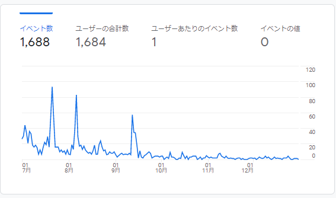

# 結果

## 接触人数  
Twitter：～１，２００人  
Instagram：１００～２００人  
その他：～５０人  

## アプリへの流入  
アプリ：インストール　～８０人（ユーザー作成、３０人。投稿、～１０人） 
***
# 結論
- 効果はなかった。（現状維持）
    - 明示的に「手詰まり感あるね」と話しがでた2022年7月から、下降したまま盛り返せなかった。
    
- 参考になりそうな意見や感想などは色々もらえた。

***
# Twitter

- そこそこ仲良くなったり、面白がってはもらえるが、投稿までいかない。
- 客観的にみたドリアンの立ち位置は、普通とエロの間。真面目じゃないけど、エロまではいってない。
    - 比較的普通の音声投稿系SNS：Spoon、Gravity、koebu（の今のやつ）
    - エロに振り勝った音声投稿系SNS：こえこえ、オトバナナ
    
- 「陰キャの学校」訴求はやっぱり邪魔だった。
    - 「陰キャ」という言葉は10代には、強すぎる。それ以上の人にはピンとこないか、なんとなく不快。
        - 「悩みどこかに吐き出したい」と言ってた人を誘って興味ありそうだったが、アプリストアで離脱。
        - 「陰キャ」を名乗る人に声をかけるが、「陰キャの学校」と言った時点で離脱。
- デザインの問題。
    - 怖いという意見が散見。精神的ブラクラ。
    
***
# Instagram

- 返信率は高めだが、マンツーマンのせいでものすごく気を使われる。最初の頃のように頭おかしい感じで来て欲しいのに、どうやってもあらたまった感じになる。
- インストールまではしてくれるが、定着しない。
***
# その他

- 全うな意見を頂けるが、投稿に繋がらない。議論が長引く割に、投稿に繋がらない。
***
# 今後

- 全体訴求
    - 「陰キャ」「チー牛」「チンパン」などネガティブワードは一切なくす。
    - ある程度普通に見せる。普通なサービスであってもやばいやつは一定数ちゃんと集まる。やばいやつ目立たせるのは、裏側でシステム的に行う。

- 機能修正
    - いるかを参考にする
        - アカウント一切なし（サムネイル、名前）
            - （メリット）実質人数が分からなくなる。
            - （メリット）エンゲージメントかさましできる。
        - いいね的なエンゲージメントボタン
    - yayを参考にする
        - 初投稿を、目立せたり、初投稿に対してまとめていいねみたいなことをできるようにする
    - koe-koeを参考にする
        - タグ機能。他のユーザーが投稿に対して編集できる。
        - 聞くまで内容が分からないのは嫌だという意見がちらほら。

- デザインの修正
    - やりかけをどうにかする。
    - 怖い、という意見が出ないように修正。